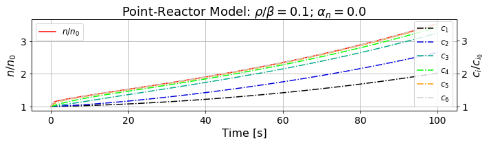
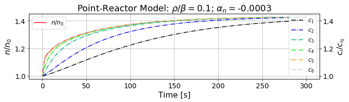

# Engy-4350 Nuclear Reactor Engineering

    University of Massachusetts Lowell, Spring 2019
    Dept. of Chemical Engineering
    Prof. Valmor F. de Almeida (valmor_dealmeida@uml.edu)
    
   

The goal of this course is to present to students of nuclear chemical engineering the elements of nuclear energy conversion to (electrical) work. This is done primarily in large scale power reactors by using nuclear heat. Although there are direct ways to convert nuclear energy into work, the focus of this course is on the prevalent mode of energy transfer using nuclear heat.

Feedback and collaboration to improve this course are welcome through GitHub `pull requests` and `issues` or direct email.

This course uses Jupyter Notebooks in Python programming language. The content can be accessed in
the following ways:
+ Static HTML version of the notebooks will be displayed on the current browser if a
notebook file listed in the code repository is clicked on. This will not allow for rendering mathematical formulae. Alternatively you can render the notebooks on [NBViewer](http://nbviewer.jupyter.org/) by clicking on the `render|nbviewer` badge above.
+ Click on the `launch/binder` badge above to launch a Jupyter Notebook server for the
course notebooks. There will be a delay for the Binder cloud server to build a
Python (Anaconda) programming environment for you. However once it is done, it will
start a Jupyter Notebook server on your web browser with all notebooks listed. Upon
clicking on individual notebook files, you will access the live course notebooks.
+ Use the green `download` button above on the right upper side of the page and download a ZIP archive to your local machine. Unzip the archive. Then use your own Jupyter Notebook server to navigate to the directory created by the unzip operation and upload the notebook files. In this case the files will not be updated and you will need to return to the repository for getting new files or updated versions of previously downloaded files.

Thanks in advance for inputs to improve this course.\
Regards,\
Valmor.
